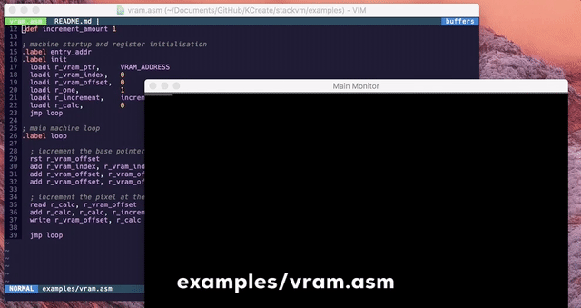
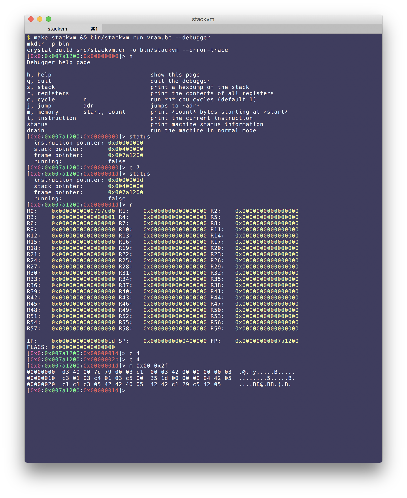
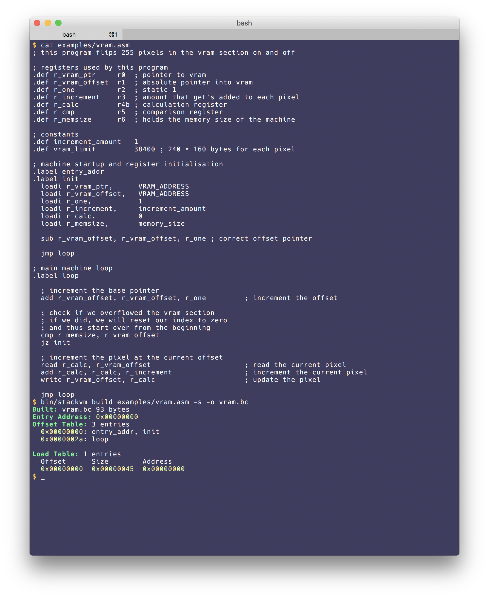

# StackVM

This is my try at writing a virtual machine from scratch. There are four main design documents
which describe the machine's functionality and how the binary format should look like.

- [Semantic](./design/semantic.md)
- [Encoding](./design/encoding.md)
- [Execution](./design/execution.md)
- [Assembly](./design/assembly.md)

This repository contains the machine itself, an assembler, a debugger and a virtual display. The machine puts it's main memory section into a memory-mapped file in the current directory where the process was started. The virtual display can load this file and will display the designated VRAM section of the machine's memory as a live video feed.

# Installation

This installation is written for macOS 10.12.4. You should however be easily able to adapt it to whatever system you're using. It also assumes you already have [homebrew](https://brew.sh/index_de.html) installed on your system.

```bash
brew install crystal-lang
brew install sdl2
git clone https://github.com/KCreate/stackvm.git
crystal deps
make stackvm
```

You will now have the compiled executable at `bin/stackvm` relative to the projects root directory.

# Usage

```
$ bin/stackvm help
Usage: asm [command]

Commands:
    run                 run a file
    build               assemble a file
    monitor             start the virtual monitor
    version             show version
    help                show this help
```

## Assemble a file

```bash
$ touch myfile.asm
$ vim myfile.asm
$ bin/stackvm build myfile.asm -o myfile.bc --stats
```

The `--stats` option will show you some statistics about the binary you just created. It includes the offsets of each label, the load table which get's embedded in the final executable, the entry address and the size of the file.

```bash
$ bin/stackvm build examples/boxes.asm -s
Built: out.bc 332 bytes
Entry Address: 0x00000000
Offset Table: 12 entries
  0x00000000: setup, entry_addr
  0x00000068: main
  0x00000085: check_zero_reached1
  0x00000092: check_zero_reached2
  0x0000009f: loop
  0x000000af: br1
  0x000000bb: br2
  0x000000c0: quit_program
  0x000000ce: msg_welcome
  0x000000eb: msg_sleep
  0x00000105: gfx_draw_pixel

Load Table: 1 entries
  Offset      Size        Address
  0x00000000  0x00000134  0x00000000
```

## Run a file

```bash
$ bin/stackvm run myfile.bc
```

### Using the debugger

StackVM has a built-in debugger you can use to debug (no shit sherlock) your programs. You launch it by normally running the `run` command but this time with the `-d` or `--debugger` option.

```
$ bin/stackvm run test.bc --debugger
[0x0:0x007a1200:0x00000000]> help
Debugger help page

h, help                            show this page
q, quit                            quit the debugger
s, stack                           print a hexdump of the stack
r, registers                       print the contents of all registers
c, cycle        n                  run *n* cpu cycles (default 1)
j, jump         adr                jumps to *adr*
m, memory       start, count       print *count* bytes starting at *start*
i, instruction                     print the current instruction
status                             print machine status information
drain                              run the machine in normal mode
[0x0:0x007a1200:0x00000000]> r
R0:    0x0000000000000000 R1:    0x0000000000000000 R2:    0x0000000000000000
R3:    0x0000000000000000 R4:    0x0000000000000000 R5:    0x0000000000000000
R6:    0x0000000000000000 R7:    0x0000000000000000 R8:    0x0000000000000000
R9:    0x0000000000000000 R10:   0x0000000000000000 R11:   0x0000000000000000
R12:   0x0000000000000000 R13:   0x0000000000000000 R14:   0x0000000000000000
R15:   0x0000000000000000 R16:   0x0000000000000000 R17:   0x0000000000000000
R18:   0x0000000000000000 R19:   0x0000000000000000 R20:   0x0000000000000000
R21:   0x0000000000000000 R22:   0x0000000000000000 R23:   0x0000000000000000
R24:   0x0000000000000000 R25:   0x0000000000000000 R26:   0x0000000000000000
R27:   0x0000000000000000 R28:   0x0000000000000000 R29:   0x0000000000000000
R30:   0x0000000000000000 R31:   0x0000000000000000 R32:   0x0000000000000000
R33:   0x0000000000000000 R34:   0x0000000000000000 R35:   0x0000000000000000
R36:   0x0000000000000000 R37:   0x0000000000000000 R38:   0x0000000000000000
R39:   0x0000000000000000 R40:   0x0000000000000000 R41:   0x0000000000000000
R42:   0x0000000000000000 R43:   0x0000000000000000 R44:   0x0000000000000000
R45:   0x0000000000000000 R46:   0x0000000000000000 R47:   0x0000000000000000
R48:   0x0000000000000000 R49:   0x0000000000000000 R50:   0x0000000000000000
R51:   0x0000000000000000 R52:   0x0000000000000000 R53:   0x0000000000000000
R54:   0x0000000000000000 R55:   0x0000000000000000 R56:   0x0000000000000000
R57:   0x0000000000000000 R58:   0x0000000000000000 R59:   0x0000000000000000

IP:    0x0000000000000000 SP:    0x0000000000400000 FP:    0x00000000007a1200
FLAGS: 0x0000000000000000
[0x0:0x007a1200:0x00000000]>
```

## Using the virtual monitor

Programs which access the machine's VRAM section are able to drive a virtual display. This display is included in the vm itself and requires SDL 2 to be installed.

A good example of the display is the `examples/vram.asm` file, which iterates over each pixel in the display and increments it's value by one.

```bash
$ bin/stackvm build examples/vram.asm -o vram.bc

# Run these two commands at the same time (e.g Each in a separate shell)
$ bin/stackvm run vram.bc
$ bin/stackvm monitor machine.memory -s 3
```

# Virtual Display



# Debugger



# Assembler



## Contributing

1. Fork it ( https://github.com/KCreate/stackvm/fork )
2. Create your feature branch (git checkout -b my-new-feature)
3. Commit your changes (git commit -am 'Add some feature')
4. Push to the branch (git push origin my-new-feature)
5. Create a new Pull Request

## Contributors

- [KCreate](https://github.com/KCreate) Leonard Schuetz - creator, maintainer
